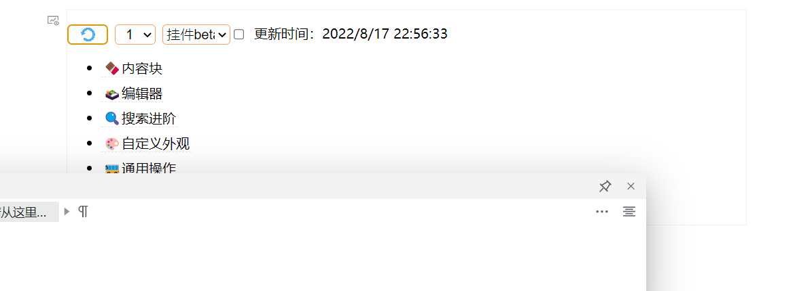
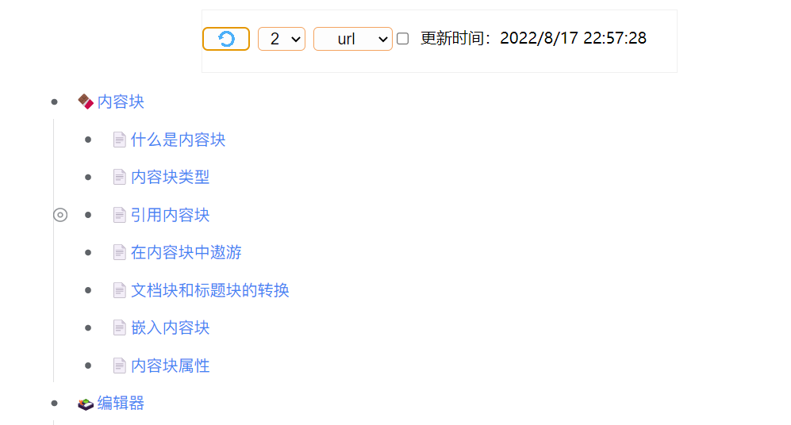
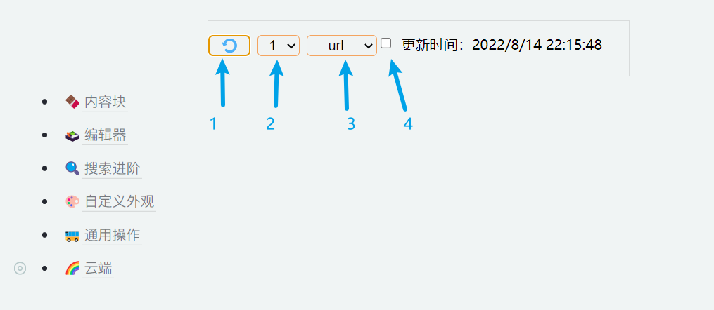

## list Child Docs列出子文档

> 当前版本： v0.0.2 修复：一些情况下重复创建块的问题

> 用于思源笔记创建、更新子文档目录列表的挂件，依靠bugs运行。

- 列出当前文档的下一层级子文档目录列表；
  
- 列出子文档方式：
  - 挂件内——`siyuan://`子文档块超链接（安卓端暂不支持打开[^3]）；
  - 挂件内——“引用块”（功能测试中）；
  - 文档中——`siyuan://`子文档块超链接；
  - 文档中——引用块（创建双链）；
  
- 在几种特定情况下自动刷新子文档目录列表：
  - 挂件被加载（例如：点击文档树打开所在文档）[^1]；
  - 点击所在文档页签[^2]；（仅windows）

<details>
    <summary>预览图片</summary>
	
    
    
    </details>


## 设置项说明

### 界面



1: 刷新按钮：单击将刷新子文档列表 ；双击将保存当前设置 ；

> 以下设置项变更后，需要双击刷新按钮保存设置，否则下次启动时将丢失更改。

2: 子文档列出层级选择：1仅列出直接子文档；

3: 列表写入模式：

- `默认`： （挂件内）将以`siyuan://`超链接的形式在挂件中展示；

- `挂件beta`：（挂件内）在挂件中展示“引用块”；

- `url`： （文档中）在挂件下方创建无序列表展示`siyuan://`超链接；

- `引用块`：（文档中）在挂件下方创建无序列表展示引用块；

4:自动刷新选项【慎用】

   勾选则启用自动刷新。

### 自定义说明

打开`${思源data目录}\widgets\listChildDocs\src\config.js`，设置项说明请参考各配置项旁边的注释。下面是其他说明：

- 创建挂件时的默认设置项等需要在该文件中修改；
- 不要将auto的默认值设定为true；
- 点击页签刷新默认仅用于windows，不适用于ios和Android。其他平台未测试，如要使用，需要手动更改`config.js`下的`includeOs`；
- 如果使用同步，请勿将`safeMode`设置为`false`；

## ⚠️注意

> 由于开发者能力所限，挂件还存在以下问题。

- 直接将子文档目录列表写入文档中（而不是挂件中）时：
  - 请避免过快地刷新文档列表；
  - 如果要<u>多设备同步文档</u>、且<u>挂件所在文档要写其他内容</u>时，**请勿使用自动刷新**[^4]；
- 每次刷新时，将完全更新列表（即使子文档没有变化，也将更新列表全部内容）；
- 双击刷新按钮会保存设置（设定挂件属性），文档编辑时间将被更新，**如果当时未完成同步，请勿双击刷新按钮**；

- 如果调整了挂件大小，请重新保存设置；

- 点击页签自动刷新的方法有点玄学，可能在未来的版本更新中无法使用；

## 反馈bug

请到github仓库[新建issue](https://github.com/OpaqueGlass/listChildDocs/issues/new/choose)，或在链滴社区内[联系挂件开发者](https://ld246.com/member/Undii)。

## 参考&感谢

本挂件参考了以下大佬的项目：

| 开发者                                      | 项目                                                     | 开源协议                                                     | 备注                 |
| ------------------------------------------- | -------------------------------------------------------- | ------------------------------------------------------------ | -------------------- |
| [leolee9086](https://github.com/leolee9086) | [cc-template](https://github.com/leolee9086/cc-template) | [木兰宽松许可证， 第2版](https://github.com/leolee9086/cc-template/blob/main/LICENSE) | 在挂件中展示“引用块“ |
| [InEase](https://github.com/InEase)         | [Note Map](https://github.com/InEase/SiYuan-Xmind)       | N/A                                                          | API使用方式          |
|                                             |                                                          |                                                              |                      |


### 依赖

1. jQuery （本项目中通过jQuery选择页面元素）；

```
 * jQuery JavaScript Library v3.6.0
 * https://jquery.com/
 *
 * Includes Sizzle.js
 * https://sizzlejs.com/
 *
 * Copyright OpenJS Foundation and other contributors
 * Released under the MIT license
 * https://jquery.org/license
```

[^1]: 例外：安全模式下，写入文档时（模式为`url`或`引用块`），将不会自动刷新。
[^2]: 通过监视页签变化获取当前文档是否更新，默认仅在windows启用，不支持ios、android系统。例外：安全模式下，写入文档时（模式为`url`或`引用块`），将不会自动刷新。
[^3]: 请等待[此issue(#3716)](https://github.com/siyuan-note/siyuan/issues/3716)完成。
[^4]: 当挂件更新文档内的目录列表后，当前设备文档编辑时间将更新。如果当前设备未同步，则新文档会覆盖云端内容，导致其他设备的编辑丢失。目前，在写入挂件时（模式为`默认`或`挂件beta`），自动刷新不更改文档内容，理论上不会影响文档编辑时间。
