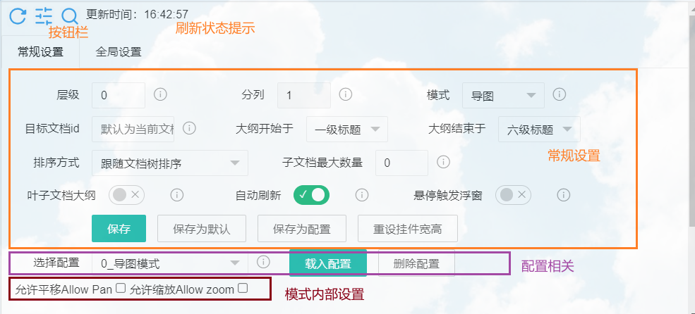

## list Child Docs列出子文档

> 当前版本：v0.2.5 **移除**：移除导入旧自定义设置`custom.js`，减少控制台日志输出；
>
> 详见更新日志CHANGELOG.md；[更新日志（网络）](CHANGELOG.md) ；

> 插入时模式为`默认`、启用自动刷新、层级1、分栏0（自动分栏）、大纲层级3。
>
> *如果正在使用文档内创建列表的模式，可考虑改为使用“目录插件”，可以在（listChildDocs设置-全局设置-最下方“重置和危险操作”）中批量删除挂件*

> 用于思源笔记创建、更新子文档目录列表的挂件。

- 创建当前文档的子文档目录列表；
  - 创建当前文档大纲列表（层级设置为`0`）；

- 子文档目录列表形式（在`模式`中选择）：
  - 挂件中或文档中创建目录；
  - 有序列表或无序列表；
  - （文档中）`siyuan://`URL或引用块；
  - （挂件中）Markmap导图；
  
- 在几种特定情况下自动刷新子文档目录列表（安全模式下不刷新文档中的目录）：\*
  - 挂件被加载（例如：点击文档树打开所在文档）；
  - 点击所在文档页签；（默认仅windows）

### 快速开始

- 双击刷新按钮保存设置项；
- 鼠标悬停在按钮或设置项旁边的i图标上，将显示提示；
- 关于模式：可以切换到相应模式后点刷新试用一下；
- 建议往下阅读`注意`部分；
- 常见问题：
  - 文档中目录列表不能自动刷新？
    默认启用了安全模式，请确认不使用同步后，可关闭安全模式；
- 快捷键（焦点在挂件上才生效，请先点击挂件空白处）
  - `Ctrl + S` 打开或关闭设置面板；
  - `Ctrl + F` 打开或关闭搜索对话框；
  - `F5` 刷新；


## 设置项说明

### 界面


1. 刷新按钮：单击将刷新子文档列表；双击将保存当前设置 ；
2. 显示/隐藏设置
3. 挂件内高亮检索；
4. 刷新情况提示；

> 设置项变更后，需要<u>**双击刷新按钮保存设置**</u>，否则下次启动时将丢失更改。

### 设置项分区



### 模式简介

模式名称前有`1.`的，将以有序列表的方式创建目录；模式名称前有`1.1.`的，将在有序列表的基础上使用全角空格缩进，创建多级编号的目录；

1. 无序列表\*

  - `默认`： （挂件中创建目录）“引用块”；

  - ~~`挂件beta`：（挂件中创建目录）“引用块”（悬停时触发浮窗，不稳定）~~ 自v0.2.2起废弃，可以启用“悬停触发浮窗”替代（但并不好用，建议禁用）；

  - `url`： （文档中创建目录）在挂件下方创建无序列表展示`siyuan://`超链接；

  - `引用块`：（文档中创建目录）在挂件下方创建无序列表展示引用块；

2. 有序列表\*

  - `1.默认`：（挂件中）有序列表“引用块”；

  - ……
3. 带层级序号的列表（请参考下文的代码片段以隐藏列表项圆点）

4. ~~任务列表~~ 
  
  - ~~`任务列表`：（文档中）~~ 【已知问题！刷新将创建一个新的任务列表，导致丢失任务的完成信息】（建议使用模板完成创建）；
5. 导图；（依赖Markmap）
6. 预览方格；（同时提供子文档的开头部分内容预览，子文档为空，则显示子文档的子文档链接）
7. 按日期分组；（按创建/更新日期倒序分组显示）
8. 本地文件夹；（从指定的本地文件夹开始，创建文件夹目录列表）（仅桌面端）

### 代码片段

#### 1.1.url模式显示效果修改

> 由于1.1 模式基于无序列表显示，如要隐藏列表项前的圆点，需要添加以下代码片段。

复制以下内容，在 设置-外观-代码片段-CSS 中添加代码片段：

```css
/* 不显示无序列表* */
.list[custom-list-format*=standard-ol-on-ul][data-subtype="u"] .protyle-action {
    display: none !important;
    border: 0;
}
/* 左侧间距调整 */
.protyle-wysiwyg [custom-list-format*=standard-ol-on-ul][data-subtype="u"] [data-node-id].li>[data-node-id] {
    margin-left: 5px !important;
}
/* 无序列表行距调整 */
.protyle-wysiwyg [custom-list-format*=standard-ol-on-ul][data-subtype="u"]  [data-node-id] {
    margin-top: 0px;
    margin-bottom: 1px;
    padding-top: 0px;
    padding-bottom: 0px;
}

.protyle-wysiwyg [custom-list-format*=standard-ol-on-ul][data-subtype="u"] .li {
    min-height: 30px;
}
/* 列表提示线调整 */
.protyle-wysiwyg  [custom-list-format*=standard-ol-on-ul][data-subtype="u"] [data-node-id].li:before {
    top: 30px;
    left: 15px;
}
```

### 自定义说明

v0.2.2版本后，挂件对设置项的保存方式有所修改。挂件将默认把数据保存至`工作空间/data/storage/listChildDocs`文件夹。

该文件夹下的数据包括：

- `data` 文件夹，保存针对文档的挂件设置，一般来说，插件插入的listChildDocs会对应给文档创建一个配置文件；
- `schema` 文件夹，默认模板配置，目前无效；
  - `default.json` 挂件插入时的默认设置；
- `global.json` 全局配置文件，需要手动保存全局设置后才会创建；
- `custom.css` 自定义的样式文件，不自动创建；

#### 默认设置和全局设置项

如果是初次升级到v0.2.2及以上版本，请在挂件手动保存默认设置、全局设置。（理论上，挂件将在首次载入时迁移原`custom.js`中保存的设置一次，设置项迁移将保留1个版本后被移除）

保存后，您可以打开`工作空间/data/storage/listChildDocs/global.json`手动对配置进行更改；

允许的配置项可参考`挂件位置/src/ConfigManager.js`的`defaultGlobalConfig`。您也可以在该文件直接更改，但如果和global.json的设置不同，将以global.json为准。

#### 自定义样式

如果对挂件的默认样式不满意，您可以自行修改，将CSS保存在`工作空间/data/storage/listChildDocs/custom.css`文件下。

## ⚠️注意

> 由于开发者能力所限，挂件还存在以下问题。使用前必读。

- 直接将子文档目录列表**写入文档中**时：
  - 请避免过快地刷新文档列表；
  - 如果要<u>多设备同步文档</u>、且<u>挂件所在文档要写其他内容</u>时，**请勿使用自动刷新**[^1]；
- 每次刷新时，将完全更新列表（即使子文档没有变化，也将更新列表全部内容）；
- **如果未完成同步，请勿点击刷新按钮**（多端同步前，在旧文档上刷新可能导致同步覆盖）[^1]：
  - 单击刷新按钮会更新文档中的目录列表或更新挂件目录列表缓存，文档编辑时间将被更新；
  - 双击刷新按钮会保存设置（设定挂件属性），文档编辑时间将被更新；
- 切换页签时自动刷新的方法有点玄学，可能在未来的版本更新中无法使用；
- 关于超级块属性刷新后重写：
  - `superBlockBeta`应设为`true`；
  - 若刷新后为超级块，属性将写入超级块的直接无序列表子块和超级块本身；
  - 若刷新前为超级块，将随机继承一个无序列表子块的属性；
  - 如要删除属性，建议直接删除超级块重新设置；
- 关于写入自定义emoji图片：
  - 请避免图片路径包括特殊符号，例如`()%& `，如果包括，不能确定实际效果;
  - 暂不支持网络emoji；

> 注：关于多端同步前刷新的详细说明，请阅读[FAQ](https://github.com/OpaqueGlass/listChildDocs/blob/main/faq.md)（挂件所在目录下的faq.md）。

## 反馈bug

请到github仓库[新建issue](https://github.com/OpaqueGlass/listChildDocs/issues/new/choose)。您也可以[在这里](https://github.com/OpaqueGlass/listChildDocs/releases)下载历史版本。

如您无法访问github仓库，请[在此反馈](https://wj.qq.com/s2/12395364/b69f/)。

## 参考&感谢

本挂件使用/参考了以下大佬的项目：

| 开发者                                            | 项目                                                         | 开源协议                                                     | 备注                            |
| ------------------------------------------------- | ------------------------------------------------------------ | ------------------------------------------------------------ | ------------------------------- |
| [leolee9086](https://github.com/leolee9086)       | [cc-template](https://github.com/leolee9086/cc-template)     | [木兰宽松许可证， 第2版](https://github.com/leolee9086/cc-template/blob/main/LICENSE) | 在挂件中展示“引用块“            |
| [InEase](https://github.com/InEase)               | [Note Map](https://github.com/InEase/SiYuan-Xmind)           | N/A                                                          | API使用方式                     |
| [Zuoqiu-Yingyi](https://github.com/Zuoqiu-Yingyi) | [widget-query](https://github.com/Zuoqiu-Yingyi/widget-query) | AGPL-3.0                                                     | 从custom.js导入自定义设置       |
|                                                   | [Trilium](https://github.com/zadam/trilium) / note-list-widget |                                                              | 预览方格模式css样式，和功能设计 |

以下大佬参与代码贡献：

- [Zuoqiu-Yingyi](https://github.com/Zuoqiu-Yingyi)；

（详见[贡献者（开发者）列表](https://github.com/OpaqueGlass/listChildDocs/graphs/contributors)）


### 依赖

1. [jQuery](https://jquery.com/) （本项目中通过jQuery选择页面元素）；

```
jQuery JavaScript Library v3.6.0  https://jquery.com/
Copyright OpenJS Foundation and other contributors
Released under the MIT license  https://jquery.org/license
```

2. [markmap](https://markmap.js.org/)；

```
markmap-lib v0.14.3 | MIT License
markmap-view v0.14.3 | MIT License
https://github.com/markmap/markmap
https://markmap.js.org/
```

3. [d3.js](https://d3js.org)；

```
BSD-3-Clause https://opensource.org/licenses/BSD-3-Clause
https://d3js.org v6.7.0 Copyright 2021 Mike Bostock
```

4. [day.js](https://day.js.org/)；

```
Day.js is licensed under a MIT License.
https://github.com/iamkun/dayjs/
https://day.js.org/
```

5. [artDialog](https://github.com/aui/artDialog)；

```
免费，且开源，基于LGPL-3.0协议。
https://github.com/aui/artDialog
aui.github.io/artDialog/
```

6. [layui](https://gitee.com/layui/layui)

```
Layui 采用 MIT 许可发布。其他相关协议亦可参考《免责声明》https://gitee.com/layui/layui/blob/main/DISCLAIMER.md。
```

7. [Sortable.js](https://github.com/SortableJS/Sortable)

```
https://github.com/SortableJS/Sortable
MIT LICENSE
```

### 图标

1. [刷新按钮图标](https://www.iconfinder.com/icons/5402417/refresh_rotate_sync_update_reload_repeat_icon)，作者：[amoghdesign](https://www.iconfinder.com/amoghdesign)，许可协议：[CC3.0 BY-NC](http://creativecommons.org/licenses/by-nc/3.0/)；

2. [设置按钮图标](https://lucide.dev/?search=setting)，[Lucide](https://github.com/lucide-icons/lucide)， [ISC License](https://lucide.dev/license)；

3. [搜索按钮图标](https://lucide.dev/?search=search) ，[Lucide](https://github.com/lucide-icons/lucide)， [ISC License](https://lucide.dev/license)。

[^1]: 点击刷新按钮将更新目录列表、挂件内目录缓存或保存设置，当前设备文档编辑时间也将更新。如果当前设备未同步，则当前设备的“旧”文档会覆盖云端内容，导致其他设备的编辑丢失。
