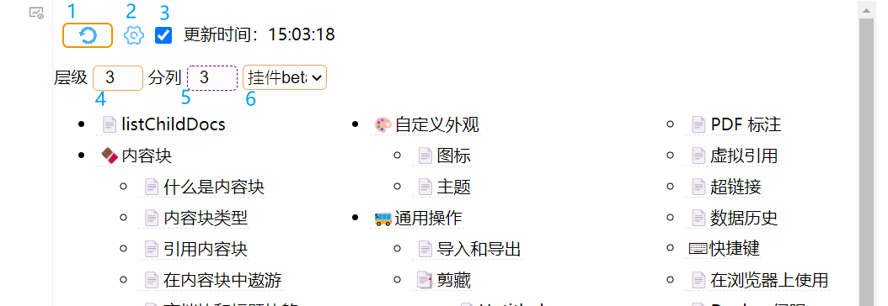

## list Child Docs列出子文档

> 当前版本： v0.2.0 **新增**：挂件内 导图(markmap)、预览方格和按时间分组模式；**新增**：自动插入助手（使用代码片段自动插入挂件）；**新增**右键子文档显示操作选项；**改进**：一些显示改进；**改进**：（挂件内模式）在一些情况下保存/加载缓存；**配置文件变更**：详见更新日志CHANGELOG.md；
> [更新日志（网页）](https://github.com/OpaqueGlass/listChildDocs/blob/main/CHANGELOG.md) 
> 
> 插入时模式为`默认`、启用自动刷新、层级1、分栏1、大纲层级3；如要修改插入时默认设置，请参考自定义说明部分。
>

> 用于思源笔记创建、更新子文档目录列表的挂件。

- 创建当前文档的子文档目录列表；
  - 创建当前文档大纲列表（层级设置为`0`）；

- 子文档目录列表形式（在`模式`中选择）：
  - 挂件中或文档中创建目录；
  - 有序列表或无序列表；
  - （文档中）`siyuan://`URL或引用块；
  - （挂件中）Markmap导图；
  
- 在几种特定情况下自动刷新子文档目录列表（安全模式下不刷新文档中的目录）：\*
  - 挂件被加载（例如：点击文档树打开所在文档）；
  - 点击所在文档页签；（默认仅windows）

### 快速开始

- 双击刷新按钮保存设置项；
- 鼠标悬停在按钮或设置项上，将显示提示；
- 关于模式：可以切换到相应模式后点刷新试用一下；
- 建议往下阅读`注意`部分。

## 设置项说明

### 界面




1. 刷新按钮：单击将刷新子文档列表；双击将保存当前设置 ；

2. 显示/隐藏设置

> 以下设置项变更后，需要<u>**双击刷新按钮保存设置**</u>，否则下次启动时将丢失更改。

3. 自动刷新选项：勾选则启用自动刷新。 

4. 子文档目录列表深度/层级选择：（控制是否展示子文档的子文档，展示几层）

   设置为1仅列出直接子文档，设置为0列出当前文档大纲，请输入数字；（过多的层级将导致性能下降）

5. 目录列表分栏数（分列数）控制：为1单列，请输入数字；（过多的分栏可能排版效果不好）

   > 当屏幕宽度过窄时（<=768px），挂件中分栏设定将会被忽略，只允许显示1列；

6. 列表写入模式：

   模式名称前有`1.`的，将以有序列表的方式创建目录；模式名称前有`1.1.`的，将在有序列表的基础上使用全角空格缩进，创建多级编号的目录；

   1. 无序列表\*

      - `默认`： （挂件中创建目录）“引用块”（无浮窗）；

      - `挂件beta`：（挂件中创建目录）“引用块”（悬停时触发浮窗，不稳定）；

      - `url`： （文档中创建目录）在挂件下方创建无序列表展示`siyuan://`超链接；

      - `引用块`：（文档中创建目录）在挂件下方创建无序列表展示引用块；

   2. 有序列表\*

      - `1.默认`：（挂件中）有序列表“引用块”（无浮窗）；

      - `1.挂件`：（挂件中）有序列表展示“引用块”（悬停时触发浮窗，不稳定）；

      - ……
   3. ~~任务列表~~ 
      
      - ~~`任务列表`：（文档中）~~ 【已知问题！刷新将创建一个新的任务列表，导致丢失任务的完成信息】（建议使用模板完成创建）；
   4. 导图；（依赖Markmap）
   5. 预览方格；（同时提供子文档的开头部分内容预览）
   6. 按日期分组；（按创建/更新日期倒序分组显示）

7. 大纲层级：列出大纲时，设定大纲的显示层级数；

> 层级数为实际层级，与h1h2无关。大纲层级选项只在勾选“叶子文档大纲” 或层级设定为`0`的情况下显示。
>
> 如果勾选“叶子文档大纲”，此项只控制大纲的显示层级。

\*注：文档中分栏使用超级块实现。

8. 目标文档id：在这里指定创建其他文档id、笔记本id或所有已开启笔记本的子文档目录列表；

   如果需要指定其他文档、笔记本，在这里粘贴id；如果要为所有已开启笔记本创建，在这里输入`/`或`\`；

9. 目标文档/笔记本名：如果指定了目标文档id，成功刷新后这里显示对应的文档名/笔记本名；

10. 叶子文档大纲：在目录列表中的叶子页面下加入该文档的大纲；

    勾选后，可以通过大纲层级设定大纲的层级数；为了区分大纲和子文档链接，大纲前用"@"标识，如要更改或删除“@”，请参考自定义设置更改`outlineDistinguishingWords`；

     ==刷新时间较长，不建议开启== 

### 代码片段

#### 自动插入助手

启用后，可以在打开父文档时，自动对空白的父文档插入listChildDocs挂件；（只有空段落块或只有空格的文档也认为是空文档）

由于需要检查是否有子文档、父文档是否为空白，**可能导致打开文档卡顿**！发现异常请停止使用（设置-外观-代码片段-JS-删除，然后重启思源）。

1. 在`config.js`（或`custom.js`）中启用只读安全模式`safeModePlus`（设置为`true`）。

2. 在 设置-外观-代码片段-JS 中添加代码片段（复制以下内容）：

    ```javascript
    import("/widgets/listChildDocs/src/addChildDocLinkHelper.js");
    ```

#### 1.1.url模式显示效果修改

复制以下内容，在 设置-外观-代码片段-CSS 中添加代码片段：

```css
/* 不显示无序列表* */
.list[custom-list-format*=standard-ol-on-ul][data-subtype="u"] .protyle-action {
    display: none !important;
    border: 0;
}
/* 左侧间距调整 */
.protyle-wysiwyg [custom-list-format*=standard-ol-on-ul][data-subtype="u"] [data-node-id].li>[data-node-id] {
    margin-left: 5px !important;
}
/* 无序列表行距调整 */
.protyle-wysiwyg [custom-list-format*=standard-ol-on-ul][data-subtype="u"]  [data-node-id] {
    margin-top: 0px;
    margin-bottom: 1px;
    padding-top: 0px;
    padding-bottom: 0px;
}

.protyle-wysiwyg [custom-list-format*=standard-ol-on-ul][data-subtype="u"] .li {
    min-height: 30px;
}
/* 列表提示线调整 */
.protyle-wysiwyg  [custom-list-format*=standard-ol-on-ul][data-subtype="u"] [data-node-id].li:before {
    top: 30px;
    left: 15px;
}
```

### 自定义说明

#### 在`config.js`中直接更改设置

打开`${思源data目录}\widgets\listChildDocs\src\config.js`，设置项说明请参考各配置项旁边的注释。举例：在此文档可以修改：

- 创建（插入）挂件时的默认参数（分列数、层级数、模式、是否自动刷新）`custom_attr`（如果写入文档，不建议将auto的默认值设定为true）；

- 安全模式`safeMode`：默认启用。

  启用后，挂件将不对文档中的目录进行自动刷新，防止同步过程中自动刷新导致同步冲突/覆盖；（如果使用同步，建议启用安全模式[^4]）；

- 只读安全模式`safeModePlus`：默认启用。

  启用后，当挂件检测到目前是历史预览页面、启用了只读模式或挂件所在文档页签不存在时，将禁止挂件刷新文档中的目录。拦截到刷新文档目录的操作时，将在挂件内显示错误提示。

- 挂件中展示目录时，根据目录长度自动更改挂件高度： `autoHeight`；默认禁用；

  （启用后，不用在挂件中上下滑动了），如果在移动端、挂件中列出目录，建议开启；

- 显示（写入）文档图标`emojiEnable`；默认启用；

- 写入自定义emoji图片：`customEmojiEnable`；默认启用【暂不支持网络emoji图片】；

- 在挂件中显示返回父文档的链接`backToParent`：默认仅在屏幕宽度<=768px的设备启用；

#### 在`custom.js`中覆盖设置

> 测试中，可能存在缺陷。理论上，即使更新挂件，这里进行覆盖的设置仍然可以保留。

创建或编辑`${思源data目录}/widgets/custom.js`，仅支持`config.js`文件中`custom_attr`（创建挂件时的默认设置）、`setting`（全局设置）、`helperSettings`（自动插入助手设置）下的设置项。以下是一个示例。

```javascript
/*方式1：若之前有config，需要添加listChildDocs的部分*/
export const config = {
    token: "",
    xxxx:{ // 其他挂件的设置
        /*其他挂件的设置*/
    },
    // 增加listChildDocs的设置
    listChildDocs: {
        setting: { // 这里的设置项对应config.js中的setting，具体设置项请参考config.js中的说明
            backToParent: "false", // 禁用显示../返回父文档链接（"auto"仅窄屏设备显示）
            autoHeight: true, // 启用挂件内自动高度
            safeMode: false, // 关闭安全模式【！若使用同步，请注意：关闭安全模式&启用自动刷新可能导致同步冲突】
            outlineDistinguishingWords: "", // 混合列出（i.e.叶子文档大纲启用）时，区分大纲的提示词
            emojiEnable: false, // 禁用插入emoji
        },
        custom_attr: {// 这里的设置项对应config.js中的custom_attr，是创建挂件时的默认设置，具体设置项请参考config.js中的说明
          printMode: "2", // url模式，其他模式见config.js结尾处说明
          listDepth: 2, // 层级深度为2
          listColumn: 1, // 目录列表分栏数为1
        }
    }
};
```

```javascript
/*方式2：为listChildDocs单独export*/
export const listChildDocs = {
    setting: { // 这里的设置项对应config.js中的setting，具体设置项请参考config.js中的说明
        backToParent: "false",// 禁用显示../返回父文档链接（"auto"仅窄屏设备显示）
        autoHeight: true, // 挂件内自动高度
        safeMode: false, // 关闭安全模式
    },
    custom_attr: {// 这里的设置项对应config.js中的custom_attr，是创建挂件时的默认设置，具体设置项请参考config.js中的说明
      printMode: "2", // url模式，其他模式见config.js结尾处说明
      listDepth: 2, // 层级深度为2
      listColumn: 1, // 目录列表分栏数为1
    }
}
```

> 关于和部分主题列表转导图功能一起使用、默认创建为导图样式（只支持单列，请不要分列），请参考自定义说明将`blockInitAttrs`设置为：
> ```javascript
>    blockInitAttrs: {
>       "custom-f": "dt",
>       "custom-type": "map"
>   },
> ```

## ⚠️注意

> 由于开发者能力所限，挂件还存在以下问题。使用前必读。

- 直接将子文档目录列表**写入文档中**时：
  - 请避免过快地刷新文档列表；
  - 如果要<u>多设备同步文档</u>、且<u>挂件所在文档要写其他内容</u>时，**请勿使用自动刷新**[^1]；
- 每次刷新时，将完全更新列表（即使子文档没有变化，也将更新列表全部内容）；
- **如果未完成同步，请勿点击刷新按钮**（多端同步前，在旧文档上刷新可能导致同步覆盖）[^1]：
  - 单击刷新按钮会更新文档中的目录列表或更新挂件目录列表缓存，文档编辑时间将被更新；
  - 双击刷新按钮会保存设置（设定挂件属性），文档编辑时间将被更新；
- 切换页签时自动刷新的方法有点玄学，可能在未来的版本更新中无法使用；
- 关于超级块属性刷新后重写：
  - `superBlockBeta`应设为`true`；
  - 若刷新后为超级块，属性将写入超级块的直接无序列表子块和超级块本身；
  - 若刷新前为超级块，将随机继承一个无序列表子块的属性；
  - 如要删除属性，建议直接删除超级块重新设置；
- 关于写入自定义emoji图片：
  - 请避免图片路径包括特殊符号，例如`()%& `，如果包括，不能确定实际效果;
  - 暂不支持网络emoji；

> 注：关于多端同步前刷新的详细说明，请阅读[FAQ](https://github.com/OpaqueGlass/listChildDocs/blob/main/faq.md)（挂件所在目录下的faq.md）。

## 反馈bug

请到github仓库[新建issue](https://github.com/OpaqueGlass/listChildDocs/issues/new/choose)。您也可以[在这里](https://github.com/OpaqueGlass/listChildDocs/releases)下载历史版本。

如您无法访问github仓库，请直接在ld246社区发帖，并@Undii。

## 参考&感谢

本挂件使用/参考了以下大佬的项目：

| 开发者                                            | 项目                                                         | 开源协议                                                     | 备注                            |
| ------------------------------------------------- | ------------------------------------------------------------ | ------------------------------------------------------------ | ------------------------------- |
| [leolee9086](https://github.com/leolee9086)       | [cc-template](https://github.com/leolee9086/cc-template)     | [木兰宽松许可证， 第2版](https://github.com/leolee9086/cc-template/blob/main/LICENSE) | 在挂件中展示“引用块“            |
| [InEase](https://github.com/InEase)               | [Note Map](https://github.com/InEase/SiYuan-Xmind)           | N/A                                                          | API使用方式                     |
| [Zuoqiu-Yingyi](https://github.com/Zuoqiu-Yingyi) | [widget-query](https://github.com/Zuoqiu-Yingyi/widget-query) | AGPL-3.0                                                     | 从custom.js导入自定义设置       |
|                                                   | [Trilium](https://github.com/zadam/trilium) / note-list-widget |                                                              | 预览方格模式css样式，和功能设计 |

以下大佬参与代码贡献：

- [Zuoqiu-Yingyi](https://github.com/Zuoqiu-Yingyi)；

（详见[贡献者（开发者）列表](https://github.com/OpaqueGlass/listChildDocs/graphs/contributors)）


### 依赖

1. [jQuery](https://jquery.com/) （本项目中通过jQuery选择页面元素）；

```
jQuery JavaScript Library v3.6.0  https://jquery.com/
Copyright OpenJS Foundation and other contributors
Released under the MIT license  https://jquery.org/license
```

2. [markmap](https://markmap.js.org/)；

```
markmap-lib v0.14.3 | MIT License
markmap-view v0.14.3 | MIT License
https://github.com/markmap/markmap
https://markmap.js.org/
```

3. [d3.js](https://d3js.org)；

```
BSD-3-Clause https://opensource.org/licenses/BSD-3-Clause
https://d3js.org v6.7.0 Copyright 2021 Mike Bostock
```

4. [day.js](https://day.js.org/)；

```
Day.js is licensed under a MIT License.
https://github.com/iamkun/dayjs/
https://day.js.org/
```

5. [artDialog](https://github.com/aui/artDialog)；

```
免费，且开源，基于LGPL-3.0协议。
https://github.com/aui/artDialog
aui.github.io/artDialog/
```

### 图标

1. [刷新按钮图标](https://www.iconfinder.com/icons/5402417/refresh_rotate_sync_update_reload_repeat_icon)，作者：[amoghdesign](https://www.iconfinder.com/amoghdesign)，许可协议：[CC3.0 BY-NC](http://creativecommons.org/licenses/by-nc/3.0/)；

2. [设置按钮图标](https://lucide.dev/?search=setting)，[Lucide](https://github.com/lucide-icons/lucide)， [ISC License](https://lucide.dev/license)；

3. [搜索按钮图标](https://lucide.dev/?search=search) ，[Lucide](https://github.com/lucide-icons/lucide)， [ISC License](https://lucide.dev/license)。

[^1]: 点击刷新按钮将更新目录列表、挂件内目录缓存或保存设置，当前设备文档编辑时间也将更新。如果当前设备未同步，则当前设备的“旧”文档会覆盖云端内容，导致其他设备的编辑丢失。
